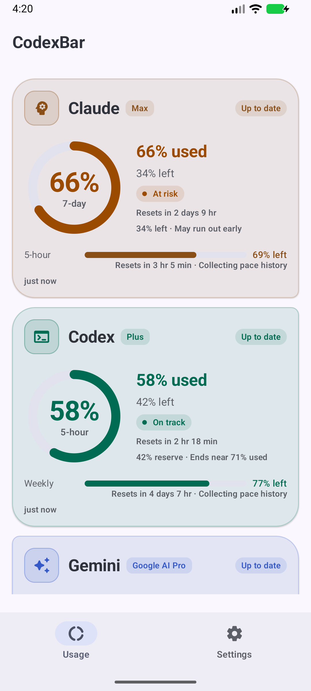
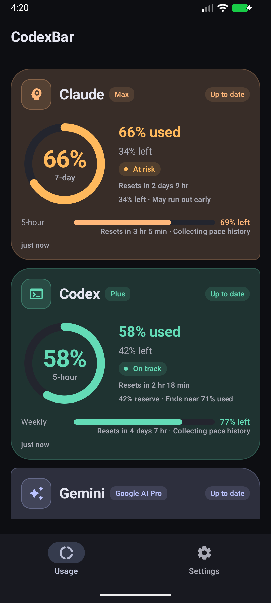
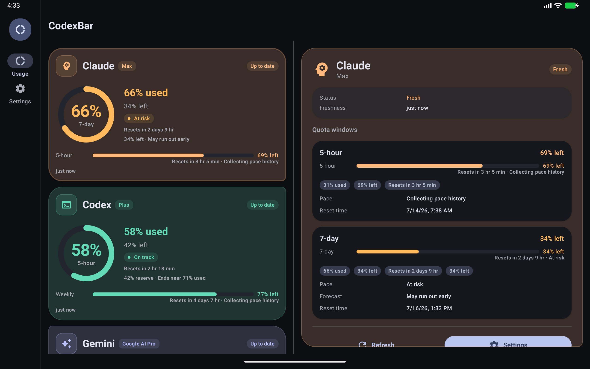
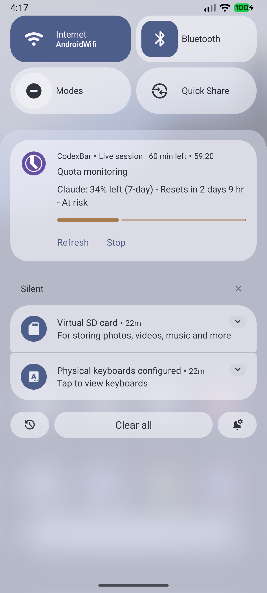
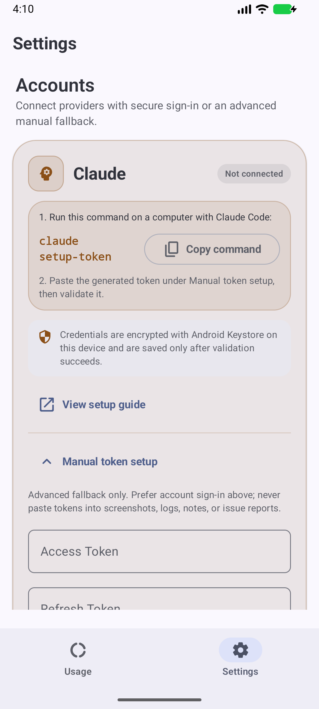

# CodexBar for Android

> Android port of [**CodexBar**](https://github.com/steipete/CodexBar) by [@steipete](https://github.com/steipete) — the macOS menu bar app for monitoring AI service quotas.

Monitor your AI service quotas from your Android device. Track remaining usage for Claude, Codex (ChatGPT), Gemini, and GitHub Copilot in one place.

<p align="center">
  
  &nbsp;&nbsp;
  
</p>

<p align="center"><sub>Demo quota data is shown in screenshots. No account credentials are included.</sub></p>

## Features

- Unified quota monitoring for Claude, Codex, Gemini, and GitHub Copilot
- Material 3 Expressive provider cards with animated rings, bars, exact values, reset countdowns, and pace forecasts
- Adaptive phone navigation and a two-pane large-screen dashboard
- Quick Settings tile for at-a-glance status
- Per-widget Android home screen customization for providers, quota windows, reset time, freshness, and pace
- Configurable background refresh plus explicit refresh actions that supersede stale queued work
- API 36 promoted Live Update with progress, remaining quota, reset, pace, Refresh, and Stop; compatible ongoing notification on older Android versions
- Secure device-code account connection for Codex, Gemini, and GitHub Copilot, with a validated Claude setup-token fallback
- Push alert when quota resets (fully replenished)
- DataStore + Android Keystore-backed credential storage
- English and Japanese per-app language selection
- Dynamic color, light/dark themes, and responsive widget layouts

## Live monitoring and large screens

<p align="center">
  
</p>

<p align="center">
  
  &nbsp;&nbsp;
  
</p>

## Download

Signed APKs are available on this fork's [Releases](https://github.com/lingmulongtai/CodexBar-android/releases/latest) page.

### Install the release APK

1. Download [**app-release.apk**](https://github.com/lingmulongtai/CodexBar-android/releases/latest/download/app-release.apk) from the latest GitHub Release. Do not install a source archive or a debug APK from an untrusted location.
2. For an integrity check, download `SHA256SUMS` from the same Release and compare the APK hash on your computer:

   ```powershell
   # Windows PowerShell
   (Get-FileHash .\app-release.apk -Algorithm SHA256).Hash
   ```

   ```bash
   # macOS or Linux
   sha256sum app-release.apk
   ```

3. Transfer the APK to the Android device if it was downloaded elsewhere, then open it from the browser or file manager.
4. If Android blocks the installer, allow **Install unknown apps** only for the browser or file manager currently opening the APK. The exact Settings path varies by device manufacturer.
5. Choose **Install**. For an update, install over the existing app so encrypted settings and provider connections remain in place.
6. After installation, turn off the temporary **Install unknown apps** permission again.

If Android reports a signature conflict, first confirm that both APKs came from this repository's Releases. Uninstalling the existing app is a last resort because it deletes locally encrypted credentials, settings, and cached usage data.

No backend server is used. Provider tokens are processed and stored strictly on-device.

## Security & Backup

Provider credentials are stored in `codexbar_secure_prefs`, an on-device DataStore whose values are encrypted with Android Keystore-backed AES-GCM keys. That DataStore is explicitly excluded from Android cloud backup and device-to-device transfer. After restoring or moving to a new device, providers must be linked again instead of reusing undecryptable credential ciphertext from the old device.

## Architecture & Verification

- [Provider account-linking architecture](docs/provider-auth-architecture.md)
- [Android widget feature parity](docs/widget-feature-parity.md)
- [Verification matrix](docs/verification-matrix.md)

## Setup

For normal use, install the signed APK from the latest release and open **Settings** to connect accounts or enter fallback tokens.

For local development:

1. Install [OpenJDK 17](https://formulae.brew.sh/formula/openjdk@17) (or any JDK 17+)
2. Clone and open the project in Android Studio
3. Build and install the debug APK
4. Open the app and go to **Settings** to connect accounts or enter fallback tokens

## Connecting Accounts

### Device-code sign-in: exact flow

Codex, Gemini, and GitHub Copilot use a device-code flow. The app intentionally shows the code before opening a browser so it can be copied safely:

1. Open **Settings**, expand the provider, and tap **Connect account**.
2. Wait for the one-time code card. The browser does not open automatically.
3. Tap **Copy paste-ready code**. The copied value removes spaces and separators so the entire code can be pasted into the first field, including pages that display split code boxes.
4. Tap **Open sign-in page** and verify the browser address before entering the code.
5. Paste the complete code, sign in to the intended account, and approve the connection.
6. When the website reports success, return to the same Settings screen before the displayed expiry time. Do not force-close the app.
7. Wait for the app to validate the returned credential and show the connected state. Browser success alone does not mean the on-device validation and encrypted save have finished.
8. If the code expires or the app reports a failure, tap **Connect account** again and use the newly issued code. Do not reuse an old code.

| Provider | Expected sign-in host | Before starting |
| --- | --- | --- |
| Codex | `auth.openai.com` | Use the ChatGPT account whose Codex usage you want to monitor. |
| Gemini | `google.com` or a `*.google.com` subdomain | Enter a public/native Google OAuth Client ID; never enter a client secret. |
| GitHub Copilot | `github.com` | Use the GitHub account whose Copilot usage you want to monitor. |

Treat a sign-in code as a short-lived credential. Enter it only on the page opened by the app, and never include codes or tokens in screenshots, logs, notes, or GitHub issues. The app never asks for the provider password; password and multi-factor authentication remain in the provider's browser page.

Troubleshooting:

- **No code card appears:** confirm the app is current, retry on a working network, and record only the app version and non-secret error text. Never attach the response body if it contains a device code.
- **The website says complete but the app is still waiting:** return to the app, keep the network connected, and allow several seconds for polling and credential validation. If the displayed expiry passes, request a new code.
- **A DNS error appears:** check Private DNS, VPN, ad blockers, and network access. Codex sign-in retries transient DNS failures until the current code expires.
- **Sign-in succeeds but quota validation fails:** confirm that the selected account has access to the provider product and usage data being monitored.

### Claude (Anthropic)

Claude does not expose a supported Android device-code flow for third-party apps. Use Claude Code's long-lived setup token instead:

```bash
claude setup-token
```

Paste the generated OAuth token into the Claude **Access Token** field in Settings. Avoid copying raw Keychain exports into logs, notes, or issue reports.

### Codex (OpenAI / ChatGPT)

Follow the device-code steps above. The app opens `https://auth.openai.com/codex/device` only after you press **Open sign-in page**, polls for completion, and saves the returned tokens only after validation.

Manual fallback, if needed:

```bash
# Access token
cat ~/.codex/auth.json | python3 -c "import sys,json; print(json.loads(sys.stdin.read())['tokens']['access_token'])"

# Refresh token
cat ~/.codex/auth.json | python3 -c "import sys,json; print(json.loads(sys.stdin.read())['tokens']['refresh_token'])"
```

Do not extract bearer tokens from browser DevTools unless you are debugging locally and understand the exposure risk.

### Gemini (Google)

Enter a Google OAuth Client ID for a public/native client, then follow the device-code steps above. The app uses Google's device authorization grant with the `https://www.googleapis.com/auth/cloud-platform` scope, then stores the access token, refresh token, and client ID encrypted on-device. Client secrets are not accepted, stored, or sent because native Android apps cannot keep them confidential.

Manual fallback, if needed:

```bash
# 1. Access token
python3 -c "import json; print(json.load(open('$HOME/.gemini/oauth_creds.json'))['access_token'])"

# 2. Refresh token
python3 -c "import json; print(json.load(open('$HOME/.gemini/oauth_creds.json'))['refresh_token'])"
```

Paste the access token, refresh token, and OAuth Client ID into Settings only when you cannot use the in-app account link flow. Do not paste a Google OAuth client secret; this app rejects that pattern.

### GitHub Copilot

Follow the device-code steps above. The app opens `https://github.com/login/device` only after you press **Open sign-in page**, then fetches Copilot quota data after GitHub authorization and on-device credential validation complete.

## Build

```bash
./gradlew assembleDebug
```

APK output: `app/build/outputs/apk/debug/app-debug.apk`

Recommended local checks before opening a PR:

```bash
./gradlew --dependency-verification=strict testDebugUnitTest lint assembleDebug
```

## Dependency Verification

Gradle Wrapper distribution checksums and dependency verification metadata are committed. When intentionally changing Gradle, plugins, or libraries, regenerate verification metadata with:

```bash
./gradlew --write-verification-metadata sha256 lint testDebugUnitTest assembleDebug
```

Review and commit `gradle/verification-metadata.xml` together with the dependency change. CI runs with `--dependency-verification=strict` and validates the Gradle Wrapper before compilation.

## Release Builds

Public releases are built only from `v*` Git tags by the protected release workflow. Signing material must stay in GitHub environment secrets:

- `ANDROID_KEYSTORE_BASE64`
- `ANDROID_KEYSTORE_PASSWORD`
- `ANDROID_KEY_ALIAS`
- `ANDROID_KEY_PASSWORD`

The release workflow publishes signed APK/AAB artifacts, `SHA256SUMS`, a CycloneDX dependency SBOM, a build provenance JSON file, and GitHub artifact attestations. Debug APKs from CI are short-lived test artifacts only.

## Tech Stack

- Kotlin 2.3.21, Jetpack Compose, Material 3 Expressive
- Hilt (DI), Retrofit2 + OkHttp (networking)
- WorkManager (background sync), DataStore + Android Keystore-backed encryption
- Glance AppWidget, Quick Settings tile, Android notification/live monitoring APIs
- KSP, kotlinx.serialization

## Acknowledgments

Based on [CodexBar](https://github.com/steipete/CodexBar) by Peter Steinberger.

## License

[MIT](LICENSE)
